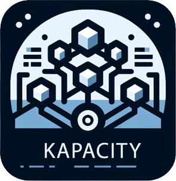
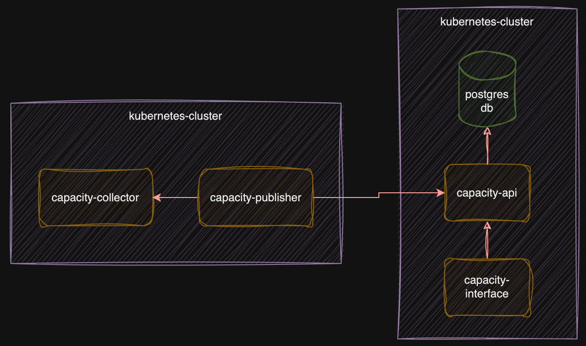

# Kapacity -  Kubernetes Capacity Management

Kapacity is an open-source capacity management tool designed to optimize and streamline data collection and visualization processes within Kubernetes environments. This tool efficiently collects data on namespaces, deployments, and statefulsets, then integrates seamlessly with the Kapacity-API to store this data in a PostgreSQL database. The insights derived from this data are visualized through the Kapacity Interface, providing a clear and actionable overview of resource utilization.

## Components

- **kapacity-postgres**: A PostgreSQL database setup designed for robust data storage.
- **kapacity-collector**: A Go (Golang) based service for efficient data collection and processing.
- **kapacity-interface**: A React application providing a dynamic and responsive user interface.
- **kapacity-api**: A Go (Golang) based API that interfaces between the database and the front-end application.

## Getting Started

tbd...

## Contributing

Contributions are what make the open-source community such an amazing place to learn, inspire, and create. Any contributions you make are **greatly appreciated**.

1. Fork the Project
2. Create your Feature Branch (`git checkout -b feature/AmazingFeature`)
3. Commit your Changes (`git commit -m 'Add some AmazingFeature'`)
4. Push to the Branch (`git push origin feature/AmazingFeature`)
5. Open a Pull Request

## License

Distributed under the Apache 2.0 License. See [`LICENSE`](https://github.com/Aetrius/Kapacity/blob/main/LICENSE) for more information.

## Contact

Project Link: [https://github.com/Aetrius/Kapacity](https://github.com/Aetrius/Kapacity)
